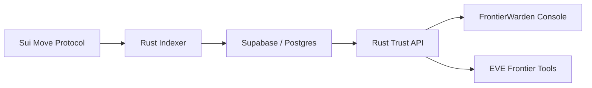

# FrontierWarden

FrontierWarden is a proof-backed trust decision service for EVE Frontier tools.

It answers one high-consequence question:

```text
Should this pilot pass this gate, and what proof supports that decision?
```

FrontierWarden is designed to be a trust backend that other EVE Frontier tools can call for reputation-backed decisions.

## Current Status

Status as of 2026-04-29:

- Sui testnet protocol package is deployed and upgraded.
- Rust indexer projects protocol events into Supabase/Postgres.
- Public Supabase table access is locked down; reads go through the Rust API.
- Rust API supports opt-in `EFREP_API_KEY` authentication for non-health routes.
- Rust API supports opt-in in-process rate limiting with `EFREP_RATE_LIMIT_PER_MINUTE`.
- React operator console requires a wallet-signed session before mounting the dashboard.
- React operator console builds cleanly.
- Sponsored gate policy update, gate passage, and toll withdrawal flows have been proven.
- Trust Decision API v0 is live locally and backed by indexed chain state.

## Operational Proofs

Key protocol flows are verified on Sui Testnet and tracked in the [Operational Proof Log](./PROOF_LOG.md).

| Flow | Transaction Digest | Status |
|---|---|---|
| **Gate Policy Update** | `G4fGxvg...hrTvsC` | ✅ Indexed |
| **Toll Withdrawal** | `CAJWpnW...5voud` | ✅ Indexed |

Key docs:

- [Trust API](./Documents/TRUST_API.md)
- [Security Model](./SECURITY.md)

## For EVE Tool Builders

If you are building EVE Frontier tools (CradleOS-style tribe consoles, gate control, route planners, or bounty/cargo boards), treat FrontierWarden as a remote trust engine:

- **Evaluate Trust**: Call `POST /v1/cradleos/gate/evaluate` (or `POST /v1/trust/evaluate`) with a pilot address and gate ID to receive `ALLOW_FREE` / `ALLOW_TAXED` / `DENY` decisions plus a proof bundle you can surface in your own UI.
- **Verify Live State**: Use the [Operational Proof Log](./PROOF_LOG.md) to verify that gate policy updates and toll withdrawals are actually live on Sui testnet and indexed by the Rust API before wiring into production-like flows.
- **Complementary Design**: FrontierWarden is designed to complement existing tribe/structure dashboards: you keep your UX and controls; it answers the high-consequence trust questions with verifiable evidence.

## Trust Decision API

Core endpoints:

```http
POST /v1/trust/evaluate
POST /v1/trust/explain
POST /v1/cradleos/gate/evaluate
```

Example request:

```json
{
  "entity": "0xplayer",
  "action": "gate_access",
  "context": {
    "gateId": "0xgate",
    "schemaId": "TRIBE_STANDING"
  }
}
```

Example response shape:

```json
{
  "decision": "ALLOW_FREE",
  "allow": true,
  "reason": "ALLOW_FREE",
  "score": 750,
  "threshold": 500,
  "proof": {
    "source": "indexed_protocol_state",
    "schemas": ["TRIBE_STANDING"],
    "attestationIds": ["0x..."],
    "txDigests": ["..."]
  }
}
```

Current live smoke proof:

- Pilot A with `TRIBE_STANDING` score `750` against threshold `500` returns `ALLOW_FREE`.
- Pilot B (no standing) returns `DENY_NO_STANDING_ATTESTATION` until it receives standing proof.

Full API contract: [Documents/TRUST_API.md](./Documents/TRUST_API.md).

## Architecture



Main layers:

- `sources/`: Sui Move modules for profiles, schemas, oracles, attestations, vouches, lending, fraud challenges, and reputation gates.
- `indexer/`: Rust event ingester and Axum REST API.
- `frontend/`: React/Vite operator console.
- `sdk/trustkit/`: small TypeScript client for external integrations.
- `Documents/`: operational notes and API docs.

## Protocol Modules

| Module | Purpose |
|---|---|
| `schema_registry.move` | Register and deprecate attestation schemas. |
| `oracle_registry.move` | Register staked oracles and authorize schemas. |
| `profile.move` | Maintain player reputation profiles and score cache. |
| `attestation.move` | Issue and revoke subject attestations. |
| `vouch.move` | Stake-backed social collateral. |
| `lending.move` | Reputation and vouch-backed loan mechanics. |
| `fraud_challenge.move` | Challenge and resolve fraudulent attestations. |
| `reputation_gate.move` | Gate allow/toll/deny policy from standing attestations. |
| `singleton.move` | Item-level singleton attestations. |
| `system_sdk.move` | SDK-facing helpers for system integrations. |

## Quick Start

Prerequisites:

- Sui CLI
- Node.js 18+
- Rust toolchain
- Postgres/Supabase database for the indexer

Install dependencies:

```bash
npm install
cd frontend
npm install
```

Run Move tests:

```bash
sui move test --build-env testnet
```

## Security

This is pre-mainnet software. Known pre-mainnet limitations are tracked privately. Do not deploy to mainnet without audit.

Before production:
- Complete a Move security review.
- Enable `EFREP_API_KEY` on the Rust API.
- Enable `EFREP_RATE_LIMIT_PER_MINUTE` and deployment-level rate limits.
- Use wallet-signed operator sessions for browser access.
- Expand observability and deploy behind gateway-level rate limits.
- Verify EVE/EVT payment coin type before replacing SUI test flows.
- Keep database credentials out of committed config.

See [SECURITY.md](./SECURITY.md) for the security model and disclosure policy.

## License

FrontierWarden / Sui TrustKit is licensed under the **Business Source License 1.1** (BSL).

- **Non-Commercial Use**: You are free to use, modify, and redistribute the software for non-commercial purposes.
- **Commercial Use**: Any production use for commercial purposes requires a separate commercial license from Kodaxadev.
- **Data Protection**: This license does not grant rights to the proprietary data or datasets processed by the system. Unauthorized scraping or extraction of reputation data is prohibited.

The software will automatically convert to the **Apache License, Version 2.0** on April 29, 2030.

See [LICENSE](./LICENSE) for the full text.

## Contact

For inquiries regarding commercial licensing, security disclosures, or integration support, please contact **Kodaxadev** at **Justin.DavisWE@icloud.com**.
