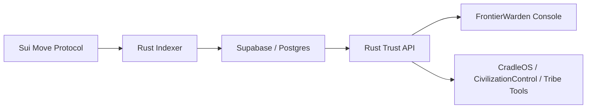

# FrontierWarden

FrontierWarden is a proof-backed trust decision service for EVE Frontier tools.

It answers one high-consequence question first:

```text
Should this pilot pass this gate, and what proof supports that decision?
```

The strategic lane is deliberately narrow. FrontierWarden is not trying to be a
full tribe operating console. It is the trust backend those consoles can call.

```text
CradleOS runs the tribe. FrontierWarden tells the tribe who to trust.
```

## Current Status

Status as of 2026-04-29:

- Sui testnet protocol package is deployed and upgraded.
- Rust indexer projects protocol events into Supabase/Postgres.
- Public Supabase table access is locked down; reads go through the Rust API.
- React operator console builds cleanly.
- Sponsored gate policy update, gate passage, and toll withdrawal flows have been proven.
- Trust Decision API v0 is live locally and backed by indexed chain state.

Key docs:

- [Trust API](./Documents/TRUST_API.md)
- [Updated Roadmap](./Documents/updated_roadmap.md)
- [Security Model](./SECURITY.md)

## Trust Decision API

Core endpoints:

```http
POST /v1/trust/evaluate
POST /v1/trust/explain
POST /v1/cradleos/gate/evaluate
```

Example request:

```json
{
  "entity": "0xplayer",
  "action": "gate_access",
  "context": {
    "gateId": "0xgate",
    "schemaId": "TRIBE_STANDING"
  }
}
```

Example response shape:

```json
{
  "decision": "ALLOW_FREE",
  "allow": true,
  "reason": "ALLOW_FREE",
  "score": 750,
  "threshold": 500,
  "proof": {
    "source": "indexed_protocol_state",
    "schemas": ["TRIBE_STANDING"],
    "attestationIds": ["0x..."],
    "txDigests": ["..."]
  }
}
```

Current live smoke proof:

- Slush wallet with `TRIBE_STANDING` score `750` against threshold `500` returns `ALLOW_FREE`.
- EVE wallet `0xabff3b1b9c793cf42f64864b80190fd836ac68391860c0d27491f3ef2fb4430f` currently returns `DENY_NO_STANDING_ATTESTATION` until it receives standing proof.

Full API contract: [Documents/TRUST_API.md](./Documents/TRUST_API.md).

## Architecture



Main layers:

- `sources/`: Sui Move modules for profiles, schemas, oracles, attestations, vouches, lending, fraud challenges, and reputation gates.
- `indexer/`: Rust event ingester and Axum REST API.
- `frontend/`: React/Vite operator console.
- `sdk/trustkit/`: small TypeScript client for external integrations.
- `Documents/`: current roadmap, trust API docs, and operational notes.

## Protocol Modules

| Module | Purpose |
|---|---|
| `schema_registry.move` | Register and deprecate attestation schemas. |
| `oracle_registry.move` | Register staked oracles and authorize schemas. |
| `profile.move` | Maintain player reputation profiles and score cache. |
| `attestation.move` | Issue and revoke subject attestations. |
| `vouch.move` | Stake-backed social collateral. |
| `lending.move` | Reputation and vouch-backed loan mechanics. |
| `fraud_challenge.move` | Challenge and resolve fraudulent attestations. |
| `reputation_gate.move` | Gate allow/toll/deny policy from standing attestations. |
| `singleton.move` | Item-level singleton attestations. |
| `system_sdk.move` | SDK-facing helpers for system integrations. |

## Quick Start

Prerequisites:

- Sui CLI
- Node.js 18+
- Rust toolchain
- Postgres/Supabase database for the indexer

Install dependencies:

```bash
npm install
cd frontend
npm install
```

Run Move tests:

```bash
sui move test --build-env testnet
```

Run the frontend:

```bash
cd frontend
npm run dev
```

Run the indexer/API:

```bash
cd indexer
$env:EFREP_DATABASE_URL = "<postgres-url>"
cargo run --release
```

The API listens on `http://localhost:3000`.

## TypeScript Client

A local client lives at:

```text
sdk/trustkit
```

Example:

```ts
import { createTrustkit } from '@frontierwarden/trustkit';

const trust = createTrustkit({ endpoint: 'http://localhost:3000' });

const result = await trust.evaluateCradleGateAccess({
  player: '0xplayer',
  gate: '0xgate',
});
```

## Competitive Position

CradleOS and CivilizationControl are broad EVE Frontier operating surfaces.
FrontierWarden should complement them, not copy them.

Sources:

- [CradleOS](https://github.com/r4wf0d0g23/CradleOS)
- [CivilizationControl](https://github.com/Diabolacal/CivilizationControl)
- [EVE Frontier roadmap](https://whitepaper.evefrontier.com/development-update-and-roadmap/eve-frontier-roadmap)

## Security Notes

This is pre-mainnet software.

Before production:

- Complete a Move security review.
- Add wallet-authenticated API access.
- Add rate limits and observability.
- Verify EVE/EVT payment coin type before replacing SUI test flows.
- Keep database credentials out of committed config.

See [SECURITY.md](./SECURITY.md).
