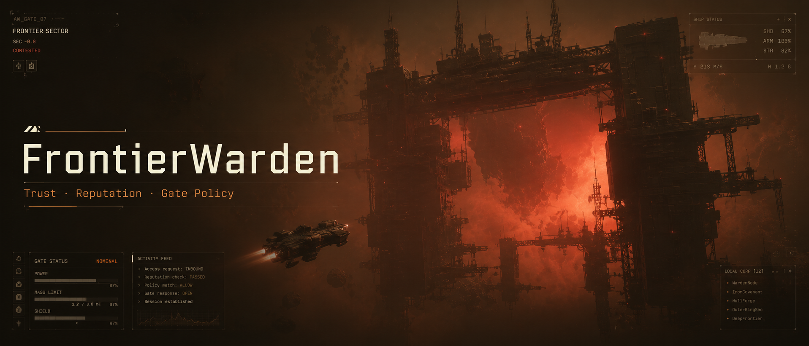
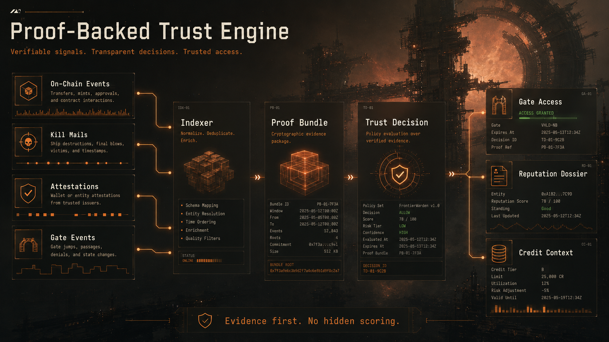
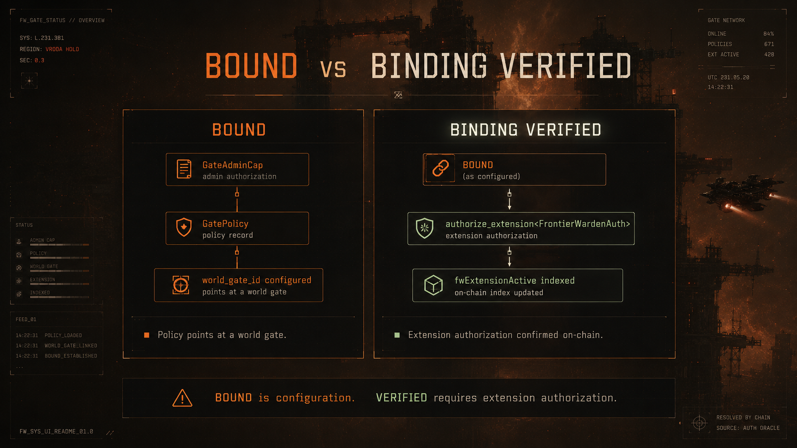
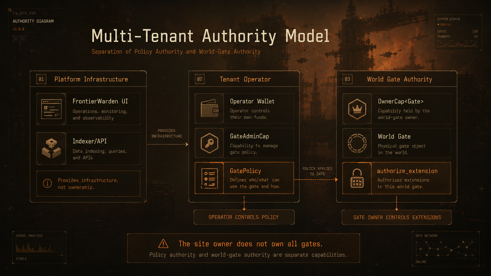
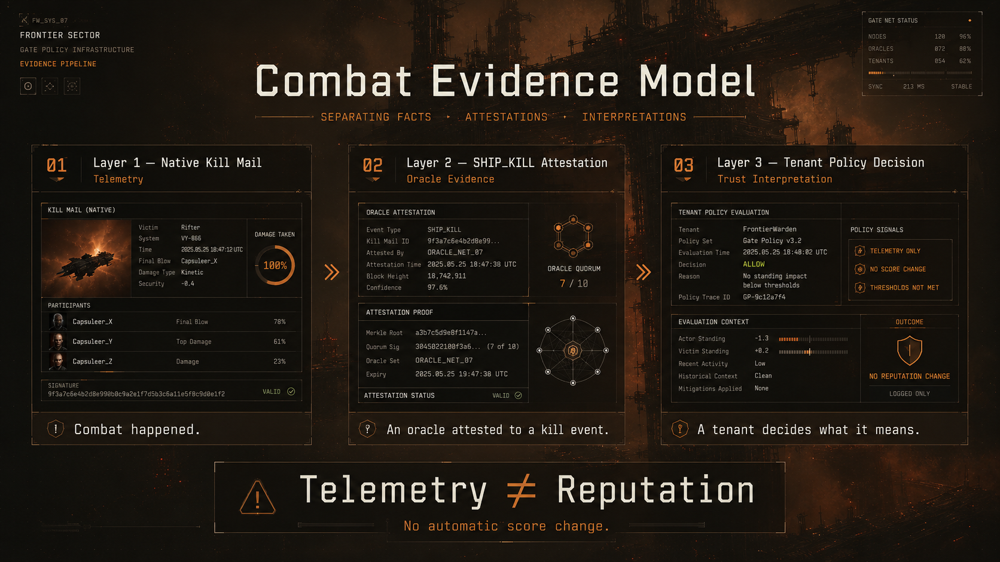
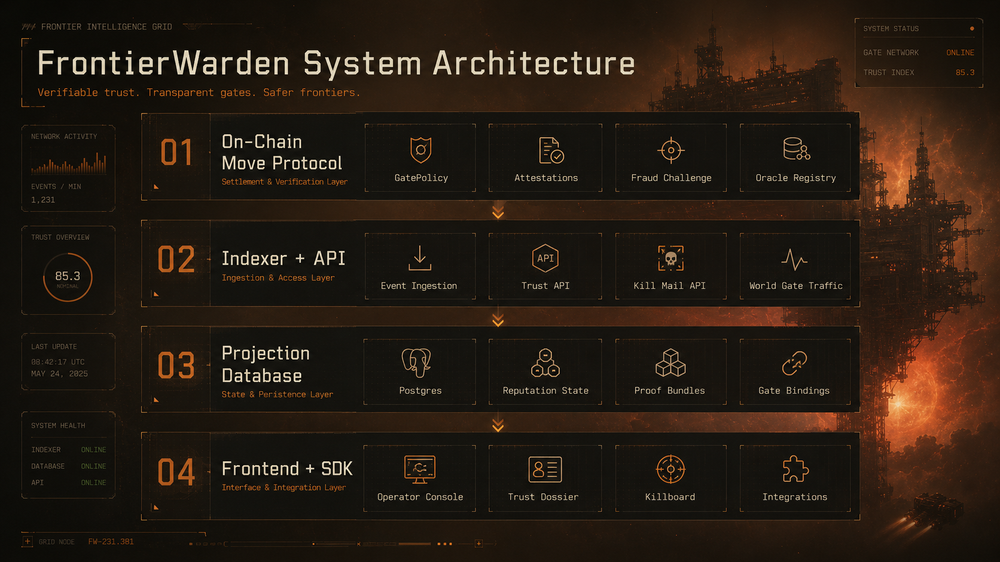

# FrontierWarden



**Proof-backed trust, reputation, and credit-risk infrastructure for EVE Frontier operators.**

FrontierWarden helps EVE Frontier tools answer high-consequence questions with evidence instead of guesswork:

> Should this pilot pass this gate?
> Should this counterparty receive credit?
> Is this reputation signal backed by proof?
> What evidence supports this decision?

FrontierWarden is not a generic killboard, leaderboard, or social score. It is a **trust decision backend** for EVE Frontier tools, tribes, markets, gate operators, bounty boards, and logistics systems.

It turns indexed on-chain activity, attestations, kill mails, gate events, and operator policy into explainable trust decisions.

---

## What FrontierWarden Does



FrontierWarden combines four layers:

1. **Protocol evidence**
   Sui Move events, attestations, vouches, schemas, fraud challenges, gate policy state, and world-gate events.

2. **Indexed projections**
   A Rust indexer/API projects Sui testnet and EVE Frontier state into fast queryable views.

3. **Proof bundles**
   Trust decisions return evidence: schemas, attestations, transaction digests, gate bindings, killmail context, and warning flags.

4. **Tenant policy**
   Each tribe/operator decides what trust means in their own political and economic context.

The result is a system where tools can ask:

```http
POST /v1/trust/evaluate
```

and receive a decision plus supporting proof.

---

## Why It Matters

EVE Frontier is not just about ships. It is about **coordination under risk**.

Tribes, markets, haulers, gate owners, bounty issuers, and lenders all need better answers to questions like:

- Is this pilot trusted by my tribe?
- Has this counterparty defaulted before?
- Is this gate policy backed by real on-chain state?
- Is this combat history relevant, or just noise?
- Can I show users why a decision happened?
- Can my tribe apply its own rules without handing control to a central platform?

FrontierWarden exists to make those decisions **transparent, explainable, and tenant-controlled**.

---

## Core Use Cases

| Use Case | What FrontierWarden Provides |
| --- | --- |
| Gate access | Allow, toll, or deny decisions based on standing attestations and gate policy |
| Reputation profiles | Indexed trust history, attestations, vouches, challenges, and evidence |
| Credit risk | Counterparty and lending context backed by proof bundles |
| Killmail context | Native killmail telemetry as dossier evidence, not automatic reputation |
| Tribe/operator policy | Tenant-scoped interpretation of trust signals |
| Tool integrations | Remote Trust API and local TypeScript SDK |

---

## Gate Binding: BOUND vs BINDING VERIFIED



FrontierWarden makes an important distinction:

| State | Meaning |
| --- | --- |
| `BOUND` | A FrontierWarden `GatePolicy` points at a world Gate ID |
| `BINDING VERIFIED` | The world Gate has authorized the FrontierWarden extension on-chain |

A gate is not fully verified just because a policy references it.
Verification requires both:

```text
GatePolicy -> world_gate_id
world_gate_id -> FrontierWardenAuth extension authorization
```

This prevents FrontierWarden from overclaiming control over gates it does not own.

---

## Tenant-Owned Authority Model



FrontierWarden is infrastructure. It does **not** assume the site owner controls every gate.

Each tribe or operator controls its own:

- `GatePolicy`
- `GateAdminCap`
- world Gate authority
- trust settings
- policy interpretation
- political relationships
- access rules

The separation is deliberate:

| Capability | Controlled By | Purpose |
| --- | --- | --- |
| `GateAdminCap` | Tenant/operator | Manage FrontierWarden gate policy |
| `OwnerCap<Gate>` | World Gate owner | Authorize extensions on the actual Gate |
| FrontierWarden API | Platform infrastructure | Index evidence and evaluate trust decisions |

The site owner provides infrastructure, not universal gate ownership.

---

## Combat Evidence Is Not Reputation



FrontierWarden now supports native EVE Frontier killmail telemetry, but killmails do **not** automatically change reputation.

The model is:

```text
Native killmail        = what happened
SHIP_KILL attestation  = oracle/trust interpretation
Tenant policy          = what it means
Reputation/credit impact = explicit audited outcome
```

A kill can mean different things to different operators:

- Positive if the victim is a tenant enemy
- Negative if the victim is an ally
- Neutral if the operator does not care about combat activity
- Relevant to credit only if tenant policy says so

FrontierWarden keeps combat data as **evidence**, not global morality.

---

## Current Live Status

FrontierWarden is live on Stillness/testnet.

| Component | Status |
| --- | --- |
| Frontend operator console | Live |
| Rust indexer/API | Live on Railway |
| Supabase/Postgres projections | Live |
| Gas station | Live |
| Trust Decision API v1 | Live |
| Native killmail poller/API | Live |
| EVE Vault / zkLogin operator session auth | Supported |
| World-gate binding state | `BOUND`, not yet `BINDING VERIFIED` |

Current active Stillness/testnet objects:

```text
Fresh binding-ready package:
0xb43fcd4e383efcb9af8c6d7b621958153dd92876da0e769b2167c2ccf409abfa

Active GatePolicy:
0x7b10f2ee46602382ad8b5a1716f7282a3f6db53b4b6346f85ec27b8308353807

Active GateAdminCap:
0x7876d36be78743903085fb0e32e56fa82424fbc6f0ee4997e9a237a14b2253a3

Bound world Gate:
0x019f53078f1501840c37ce97f3b1d48fe284c5913e8091ed922c313da3f30a7c
```

Current binding state:

```text
BOUND
not BINDING VERIFIED
```

The indexer is ready to observe `BINDING VERIFIED` once the world Gate owner authorizes `FrontierWardenAuth` for the bound Gate.

---

## Architecture



FrontierWarden is split into five major layers:

| Layer | Components |
| --- | --- |
| Protocol | Sui Move modules for profiles, schemas, attestations, vouches, lending, fraud challenges, and reputation gates |
| Indexer/API | Rust event ingester and Axum REST API |
| Database | Supabase/Postgres indexed projections |
| Frontend | React/Vite operator console |
| SDK | Local TypeScript TrustKit client for integrations |

Repository layout:

```text
sources/          Sui Move protocol modules
indexer/          Rust indexer and REST API
frontend/         React/Vite operator console
sdk/trustkit/     TypeScript client for external tools
Documents/        Architecture, API, runbooks, smoke results
media/readme/     README images and diagrams
```

---

## Protocol Modules

| Module | Purpose |
| --- | --- |
| `schema_registry.move` | Register and deprecate attestation schemas |
| `oracle_registry.move` | Register staked oracles and authorize schemas |
| `profile.move` | Maintain player reputation profiles and score cache |
| `attestation.move` | Issue and revoke subject attestations |
| `vouch.move` | Stake-backed social collateral |
| `lending.move` | Reputation and vouch-backed loan mechanics |
| `fraud_challenge.move` | Challenge and resolve fraudulent attestations |
| `reputation_gate.move` | Gate allow/toll/deny policy from standing attestations |
| `singleton.move` | Item-level singleton attestations |
| `system_sdk.move` | SDK-facing helpers for system integrations |

---

## Trust Decision API

FrontierWarden exposes a proof-backed Trust API for external tools.

Core endpoint:

```http
POST /v1/trust/evaluate
```

Supported actions:

```text
gate_access
counterparty_risk
bounty_trust
```

Example request:

```json
{
  "entity": "0xplayer",
  "action": "gate_access",
  "context": {
    "gateId": "0xgate",
    "schemaId": "TRIBE_STANDING"
  }
}
```

Example response shape:

```json
{
  "decision": "ALLOW_FREE",
  "allow": true,
  "reason": "ALLOW_FREE",
  "score": 750,
  "threshold": 500,
  "proof": {
    "source": "indexed_protocol_state",
    "schemas": ["TRIBE_STANDING"],
    "attestationIds": ["0x..."],
    "txDigests": ["..."]
  }
}
```

The important part is the `proof` bundle. FrontierWarden should never ask users to trust a black-box score.

Full API contract:

```text
Documents/TRUST_API.md
Documents/INTEGRATION_GUIDE.md
Documents/KILLMAIL_API.md
```

---

## Native Killmail API

FrontierWarden exposes native EVE Frontier killmail telemetry.

```http
GET /kill-mails?limit=&cursor=
GET /kill-mails/:id
GET /world/characters/:address/kills?limit=&cursor=
GET /world/characters/:address/losses?limit=&cursor=
GET /world/systems/:system_id/kills?limit=&cursor=
```

Killmails are used as combat evidence in dossiers. They are **not** automatic trust decisions.

---

## For EVE Frontier Tool Builders

Use FrontierWarden when your tool needs a trust decision with proof.

Good integration targets:

- Tribe dashboards
- Gate control consoles
- Route planners
- Cargo and hauling boards
- Bounty systems
- Lending and credit tools
- Reputation overlays
- Market/counterparty screens

Recommended pattern:

```text
Your app keeps the UX.
FrontierWarden evaluates trust.
Your app displays the proof bundle.
Your operator decides what to do.
```

---

## Demo Safety

This is pre-mainnet software running on Sui testnet / EVE Frontier Stillness.
Do not treat this as audited mainnet infrastructure.

Important constraints:

- No mainnet deployment has occurred.
- Public frontend config must never contain secrets.
- `VITE_*` values are public build-time variables.
- Server-side API keys and database credentials must stay server-side.
- Sponsored transaction flows require server-side validation and budget controls.
- Operator browser access uses wallet-signed session tokens.
- Public read/evaluate routes should be rate-limited.
- Combat telemetry must not become a bulk targeting export.

See:

```text
SECURITY.md
Documents/RAILWAY_VERCEL_RUNBOOK.md
Documents/OPERATOR_FLOW_RUNBOOK.md
```

---

## Quick Start

Prerequisites: Sui CLI · Node.js 18+ · Rust toolchain · Postgres/Supabase database

```bash
# Install dependencies
npm install
cd frontend && npm install

# Move tests
sui move test --build-env testnet

# Frontend checks
npm --prefix frontend run typecheck
npm --prefix frontend run build

# Rust checks
cargo build
cargo test
```

---

## Key Documentation

| Document | Purpose |
| --- | --- |
| `Documents/TRUST_API.md` | Trust API contract |
| `Documents/INTEGRATION_GUIDE.md` | Builder quickstart |
| `Documents/KILLMAIL_API.md` | Native killmail endpoints |
| `Documents/ADR_KILLMAILS_AS_TRUST_EVIDENCE.md` | Killmail evidence model |
| `Documents/TENANT_COMBAT_POLICY_DESIGN.md` | Tenant-scoped combat policy design |
| `Documents/OPERATOR_FLOW_RUNBOOK.md` | Operator flow and live smoke notes |
| `Documents/KILLMAIL_PRODUCTION_SMOKE.md` | Native killmail production smoke |
| `SECURITY.md` | Security model and disclosure policy |

---

## License

FrontierWarden / Sui TrustKit is licensed under the Business Source License 1.1.

- Non-commercial use is allowed.
- Production commercial use requires a separate commercial license from Kodaxadev.
- This license does not grant rights to proprietary data or datasets processed by the system.
- Unauthorized scraping or extraction of reputation data is prohibited.
- The software converts to the Apache License, Version 2.0 on April 29, 2030.

See `LICENSE` for the full text.

---

## Contact

For commercial licensing, security disclosures, or integration support, contact Kodaxadev:

```text
Justin.DavisWE@icloud.com
```
