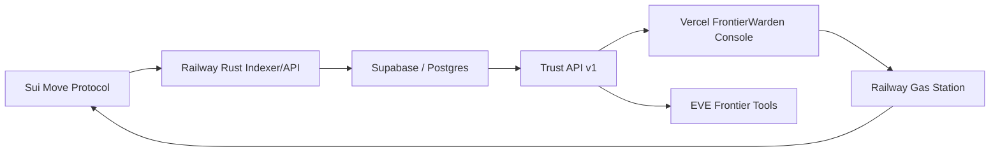

# FrontierWarden

FrontierWarden is a proof-backed trust decision service for EVE Frontier tools.

It answers one high-consequence question:

```text
Should this pilot pass this gate, and what proof supports that decision?
```

FrontierWarden is designed to be a trust backend that other EVE Frontier tools
can call for reputation-backed decisions.

## Live Status

Status as of 2026-05-05:

- Frontend demo is live at [frontierwarden.kodaxa.dev](https://frontierwarden.kodaxa.dev).
- Rust indexer/API is live on Railway and serves indexed Sui testnet state.
- Gas station service is live on Railway and reports `ready`.
- Supabase/Postgres is the backing database for indexed protocol state.
- Active environment is Stillness/testnet.
- Trust Decision API v1 is live for:
  - `gate_access`
  - `counterparty_risk`
  - `bounty_trust`
- Gate Intel loads live testnet gates from the Railway API.
- Sponsored gate-passage transactions build in the browser and reach wallet
  signing through the gas station handoff.
- Some wallet sessions can still fail at wallet signing when zkLogin proof
  fetching fails. That is a live caveat, not a claim of final gate-passage
  execution for every wallet session.
- Browser operator sessions use wallet-signed session tokens.
- No public frontend API secrets are allowed. Values prefixed with `VITE_` are
  public build-time configuration only.

## Operational Proofs

Key protocol flows are verified on Sui testnet and tracked in the
[Operational Proof Log](./PROOF_LOG.md).

| Flow | Transaction Digest | Status |
|---|---|---|
| Gate Policy Update | `G4fGxvg...hrTvsC` | Indexed |
| Toll Withdrawal | `CAJWpnW...5voud` | Indexed |

The proof log does not by itself prove that every wallet type can complete final
gate-passage execution. zkLogin wallet sessions may still fail if the wallet
cannot fetch a zkLogin proof during signing.

Key docs:

- [Trust API](./Documents/TRUST_API.md)
- [Security Model](./SECURITY.md)
- [Railway/Vercel Runbook](./Documents/DEPLOYMENT_RAILWAY_VERCEL.md)
- [Testnet Notes](./Documents/TESTNET_NOTES.md)

## For EVE Tool Builders

If you are building EVE Frontier tools such as tribe consoles, gate control,
route planners, bounty boards, or cargo/counterparty tools, treat FrontierWarden
as a remote trust engine:

- Evaluate gate access with `POST /v1/cradleos/gate/evaluate` or
  `POST /v1/trust/evaluate`.
- Evaluate counterparty and bounty trust with `POST /v1/trust/evaluate`.
- Display the returned proof bundle instead of asking users to trust a black-box
  score.
- Keep your own UX and controls; FrontierWarden answers high-consequence trust
  questions with indexed protocol evidence.

## Trust Decision API

Core endpoints:

```http
POST /v1/trust/evaluate
POST /v1/trust/explain
POST /v1/cradleos/gate/evaluate
```

Example request:

```json
{
  "entity": "0xplayer",
  "action": "gate_access",
  "context": {
    "gateId": "0xgate",
    "schemaId": "TRIBE_STANDING"
  }
}
```

Example response shape:

```json
{
  "decision": "ALLOW_FREE",
  "allow": true,
  "reason": "ALLOW_FREE",
  "score": 750,
  "threshold": 500,
  "proof": {
    "source": "indexed_protocol_state",
    "schemas": ["TRIBE_STANDING"],
    "attestationIds": ["0x..."],
    "txDigests": ["..."]
  }
}
```

Current live smoke behavior:

- A pilot with `TRIBE_STANDING` score `750` against threshold `500` returns
  `ALLOW_FREE`.
- A pilot with no standing proof returns `DENY_NO_STANDING_ATTESTATION` until it
  receives valid standing proof.

Full API contract: [Documents/TRUST_API.md](./Documents/TRUST_API.md).

## Demo Safety

This is a Sui testnet demo. No mainnet deployment has occurred.

The public frontend contains only public configuration such as URLs, package
IDs, object IDs, and network labels. Do not put API keys, database URLs, private
keys, sponsor secrets, or partner tokens in `VITE_*` variables. Vite exposes
`VITE_*` variables to client-side code after bundling; see the official Vite
environment variable docs:
[vite.dev/guide/env-and-mode](https://vite.dev/guide/env-and-mode).

Protected operations must stay behind the appropriate server-side controls:

- Operator browser access uses short-lived wallet session tokens.
- Rust API partner gates use server-only `EFREP_API_KEY` where enabled.
- Gas station sponsorship is constrained by origin controls, transaction
  validation, budget caps, and server-side secrets.
- Oracle issuing routes require server-side authorization.
- Public read/evaluate routes are unauthenticated but should be rate-limited.

## Architecture



Main layers:

- `sources/`: Sui Move modules for profiles, schemas, oracles, attestations,
  vouches, lending, fraud challenges, and reputation gates.
- `indexer/`: Rust event ingester and Axum REST API.
- `frontend/`: React/Vite operator console.
- `sdk/trustkit/`: local TypeScript client for external integrations.
- `Documents/`: operational notes and API docs.

## Protocol Modules

| Module | Purpose |
|---|---|
| `schema_registry.move` | Register and deprecate attestation schemas. |
| `oracle_registry.move` | Register staked oracles and authorize schemas. |
| `profile.move` | Maintain player reputation profiles and score cache. |
| `attestation.move` | Issue and revoke subject attestations. |
| `vouch.move` | Stake-backed social collateral. |
| `lending.move` | Reputation and vouch-backed loan mechanics. |
| `fraud_challenge.move` | Challenge and resolve fraudulent attestations. |
| `reputation_gate.move` | Gate allow/toll/deny policy from standing attestations. |
| `singleton.move` | Item-level singleton attestations. |
| `system_sdk.move` | SDK-facing helpers for system integrations. |

## Quick Start

Prerequisites:

- Sui CLI
- Node.js 18+
- Rust toolchain
- Postgres/Supabase database for the indexer

Install dependencies:

```bash
npm install
cd frontend
npm install
```

Run Move tests:

```bash
sui move test --build-env testnet
```

## Security

This is pre-mainnet software. Known pre-mainnet limitations are tracked
privately. Do not deploy to mainnet without an audit.

Before production:

- Complete a Move security review.
- Keep secrets out of all `VITE_*` frontend variables.
- Enable server-side API gates where needed.
- Enable `EFREP_RATE_LIMIT_PER_MINUTE` and deployment-level rate limits.
- Use wallet-signed operator sessions for browser access.
- Expand observability and deploy behind gateway-level rate limits.
- Verify EVE/EVT payment coin type before replacing SUI test flows.
- Keep database credentials out of committed config.

See [SECURITY.md](./SECURITY.md) for the security model and disclosure policy.

## License

FrontierWarden / Sui TrustKit is licensed under the Business Source License 1.1
(BSL).

- Non-commercial use: you may use, modify, and redistribute the software for
  non-commercial purposes.
- Commercial use: production commercial use requires a separate commercial
  license from Kodaxadev.
- Data protection: this license does not grant rights to proprietary data or
  datasets processed by the system. Unauthorized scraping or extraction of
  reputation data is prohibited.

The software will automatically convert to the Apache License, Version 2.0 on
April 29, 2030.

See [LICENSE](./LICENSE) for the full text.

## Contact

For commercial licensing, security disclosures, or integration support, contact
Kodaxadev at Justin.DavisWE@icloud.com.
